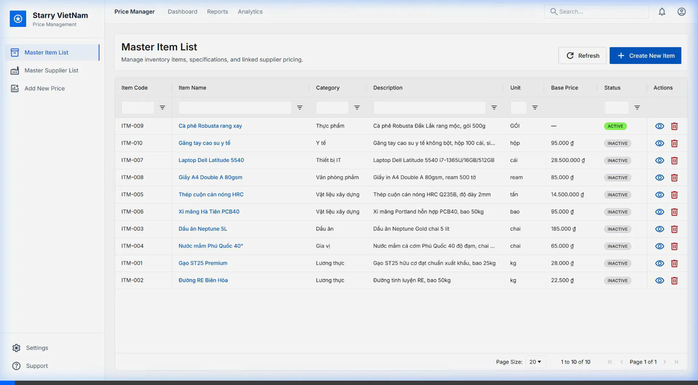
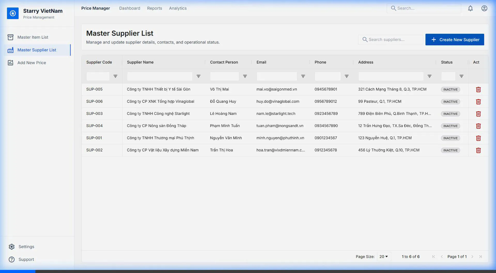
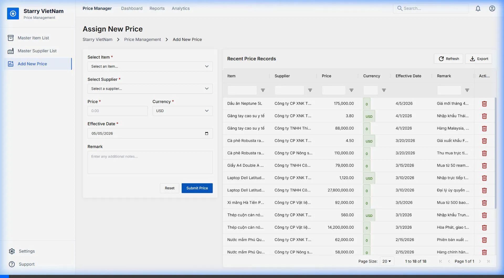
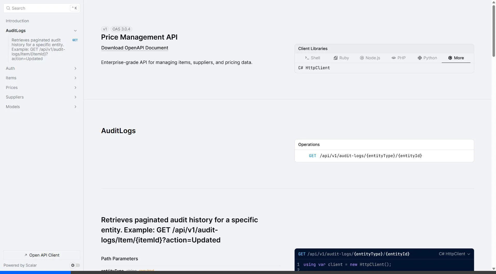

# 📦 Starry VietNam — Enterprise Price Management System

    

An ultra-high-performance, comprehensive **Price Management Tool** built for the Starry VietNam programming assessment. This system transcends a basic CRUD application by adhering strictly to **Enterprise Design Patterns**, featuring distributed SWR caching, optimistic concurrency, automated field-level audit trails, and a scalable containerized architecture.

---

## 🌐 Live Environments & System Previews

All services are orchestrated via Docker Compose and served behind an Nginx reverse proxy.

- 🖥️ **Web Application (Next.js):** [https://price-management.clouds.io.vn](https://price-management.clouds.io.vn)
- 📜 **Swagger UI (API Docs):** [https://price-management.clouds.io.vn/swagger](https://price-management.clouds.io.vn/swagger)
- 🚀 **Scalar (Modern API Docs):** [https://price-management.clouds.io.vn/scalar](https://price-management.clouds.io.vn/scalar)
- 🩺 **System Health Check:** [https://price-management.clouds.io.vn/health](https://price-management.clouds.io.vn/health)
- 💻 **GitHub Repository:** [https://github.com/HThanh-how/price-management-starry](https://github.com/HThanh-how/price-management-starry)

> **Test Credentials:**
> - **Email:** `analyst@starry.vn`
> - **Password:** `starry2026`
> *(Note: The Auth guard is currently disabled by default for ease of assessment review).*
> 
> ⏳ **Server Uptime Notice:** To optimize resources, the live demonstration server operates daily between **09:00 AM and 11:00 PM (GMT+7)**. Outside these hours, the server is automatically shut down.

### Visual Previews
| Master Item List (Master-Detail Flow) | Supplier Management |
| :---: | :---: |
|  |  |
| **Price History Management** | **API Documentation (Scalar)** |
|  |  |

---

## 🏢 Core Business Modules

The application is built around three tightly integrated core domains:

1. **Master Item List:** A dynamic inventory registry. Supports complex metadata via a schema-less JSON column allowing businesses to attach infinite custom attributes (e.g., barcodes, weight, warranty periods) without altering the database schema.
2. **Master Supplier List:** Comprehensive vendor management.
3. **Price Management:** The relational bridge between Items and Suppliers. Supports multi-currency tracking (VND, USD, EUR, JPY) via Enums, effective dates, and historical tracking.

---

## 💎 Enterprise-Grade Architecture & Features

### 1. ⚡ SWR (Stale-While-Revalidate) & Distributed Redis Caching
To achieve **Zero-Wait UI (<10ms response times)**, the system implements a highly aggressive yet safe caching strategy:
- **Dual-Key Redis Strategy:** The backend stores the actual data payload (TTL: 1 Hour) and a separate "Fresh Marker" (TTL: 3 Seconds).
- **Background Revalidation:** If a user requests data after the 3-second fresh window, the API instantly serves the "Stale" data from Redis to eliminate loading screens, while silently spinning up a `Task.Run` background thread to query MySQL and repopulate the cache.
- **Frontend Sync:** React Query (TanStack) is configured with `staleTime: 3000` to work in perfect harmony with the backend, preventing unnecessary network waterfalls.

### 2. 🛡️ Data Integrity & Concurrency Control
- **Optimistic Concurrency:** Every database table includes a `RowVersion` timestamp token. If two analysts attempt to edit the same Price/Item simultaneously, the system intercepts the database exception and prevents "lost updates", throwing a `ConflictException` to the user.
- **Soft Deletion:** Records are never physically deleted (`DELETE` statements are restricted). Instead, they are flagged with `IsDeleted` and `DeletedAt`, and EF Core Global Query Filters automatically exclude them from `SELECT` queries.
- **Transactional Consistency:** A strict `Repository Pattern` paired with a `Unit of Work` ensures all database writes are ACID compliant.

### 3. 📝 Automated Audit Logging (EF Core Interceptors)
Business logic layers should not be polluted with logging code. 
- **The `AuditInterceptor`:** A custom Entity Framework Core Interceptor automatically hooks into `SaveChanges()`. 
- **Deep Tracking:** It analyzes the ChangeTracker, recording *Who* made the change, *When*, the exact *Entity ID*, and generates a precise JSON payload comparing `OldValues` vs `NewValues` directly into an `audit_logs` table.

### 4. 🔍 Observability & Performance Monitoring
- **Slow Query Detection:** A custom `SlowQueryInterceptor` monitors EF Core execution times. Any SQL query taking longer than **200ms** is automatically flagged and logged with a `Warning` severity.
- **Structured Logging (Serilog):** All system logs are formatted as JSON. We implemented `CorrelationIdMiddleware` that assigns a unique `TraceId` to every incoming request. This ID is carried from the Nginx proxy, through the Web API controllers, down into the database commands, enabling flawless distributed tracing.

### 5. 🔐 Security & Dual-Layer Validation
- **Authentication:** Built-in Auth endpoints using robust **BCrypt** password hashing algorithms.
- **Backend Validation:** `FluentValidation` interceptors guarantee that all incoming Data Transfer Objects (DTOs) strictly adhere to business rules *before* they ever reach the API Controllers.
- **Frontend Validation:** `Zod` schemas paired with `React Hook Form` provide instant, type-safe client-side feedback.
- **RFC 7807 Problem Details:** A Global Exception Middleware catches all domain errors (NotFound, Conflict, Validation errors) and standardizes the HTTP response payload to the industry standard RFC 7807 format.

### 6. 🚀 CI/CD & DevOps Excellence
- **Automated Pipeline (GitHub Actions):** Every push triggers a robust `.github/workflows/ci.yml` workflow. It executes backend unit tests (using `xUnit` and `Moq`) and validates Docker multi-stage builds, ensuring broken code never reaches the `main` branch.
- **Full Containerization:** The entire stack is completely dockerized. A single `docker-compose.yml` orchestrates:
  - **Nginx:** Reverse Proxy & API Gateway (Handles CORS, Security Headers, GZIP, and routes `/api` to backend).
  - **.NET 10 API:** Running on Kestrel.
  - **Next.js 16:** Built using the `standalone` output for maximum Node.js optimization.
  - **MySQL 8.0 & Redis 7.x.**

### 7. 🖥️ "Hyper-Enterprise" UI/UX Architecture
- **Feature-Sliced Design (FSD):** The frontend codebase is modularized strictly by business domain (`features/items`, `features/prices`) rather than file types, ensuring massive scalability.
- **AG Grid v35 Theming API:** We bypassed legacy CSS imports in favor of the cutting-edge programmatic `themeQuartz` API, perfectly mapping Figma design tokens (colors, radii, typography) into the grid engine.
- **Master-Detail Flow:** A robust layout allowing users to view a Master Item and immediately drill down into linked Supplier details and historical price logs without navigating away.

---

## 🛠 Tech Stack Overview

| Layer | Technology | Version | Role |
|-------|-----------|---------|------|
| **Frontend UI** | Next.js + React | 16.x | SSR/CSR App Router |
| **Styling** | Tailwind CSS + Ant Design | v4 / v5 | Utility Classes & Component Library |
| **Data Tables** | AG Grid | v35 | High-Performance Data Grids |
| **State Mgmt** | TanStack Query | v5 | SWR Caching & Server State |
| **Backend API** | .NET (C#) | 10.0 | High-Performance Web API |
| **ORM** | Entity Framework Core | 10.0 | Data Access & Interceptors |
| **Database** | MySQL | 8.0 | Relational Data Store |
| **Cache** | Redis | 7.x | Distributed Cache Layer |
| **DevOps** | Docker + Nginx + Actions | - | Containerization, Proxy, CI/CD |

---

## 🚀 Getting Started (Local Development)

The entire infrastructure can be brought up locally with one command.

```bash
# 1. Clone the repository
git clone https://github.com/HThanh-how/price-management-starry.git
cd price-management-starry

# 2. Spin up the cluster
docker compose up -d --build

# 3. Monitor initialization
docker compose logs -f
```

### Access Points:
- **Frontend App:** `http://localhost:8080`
- **Swagger API Docs:** `http://localhost:8080/swagger`
- **Scalar API Docs:** `http://localhost:8080/scalar`
- **Health Check:** `http://localhost:8080/health`

---

## 🏆 Assessment Fulfillment Checklist

- [x] **Correctness**: All CRUD operations for Items, Suppliers, and Prices work flawlessly across all layers.
- [x] **Performance**: Distributed Redis caching + SWR strategy ensures UI interactions are instantaneous.
- [x] **Scalability**: Stateless backend design, containerized microservices architecture, and a highly decoupled FSD frontend.
- [x] **Maintainability**: Strict N-Layer Architecture (API, Application, Domain) enforcing SOLID principles. Zero "God classes".
- [x] **Resilience**: Redis Cache-Aside pattern automatically falls back to the database if the cache node dies. Graceful error handling via RFC 7807.
- [x] **Observability**: Trace IDs injected into JSON logs, Serilog integration, and automated Slow Query detection.
- [x] **Security**: XSS protections in Nginx, secure CORS configuration, and complete SQL Injection prevention via EF Core parameterization.

---
*Architected and engineered with ❤️ for the Starry VietNam Assessment.*
